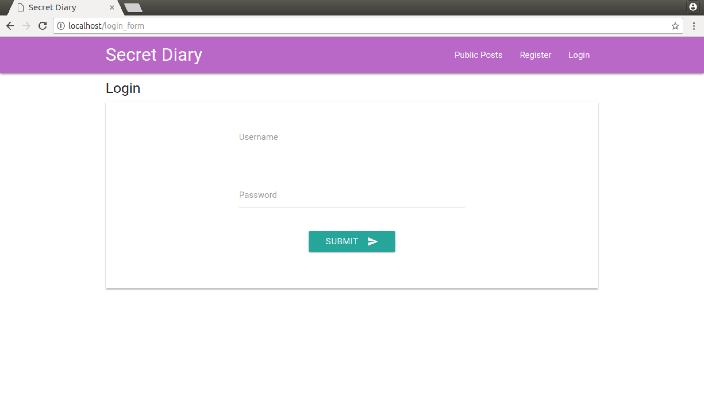
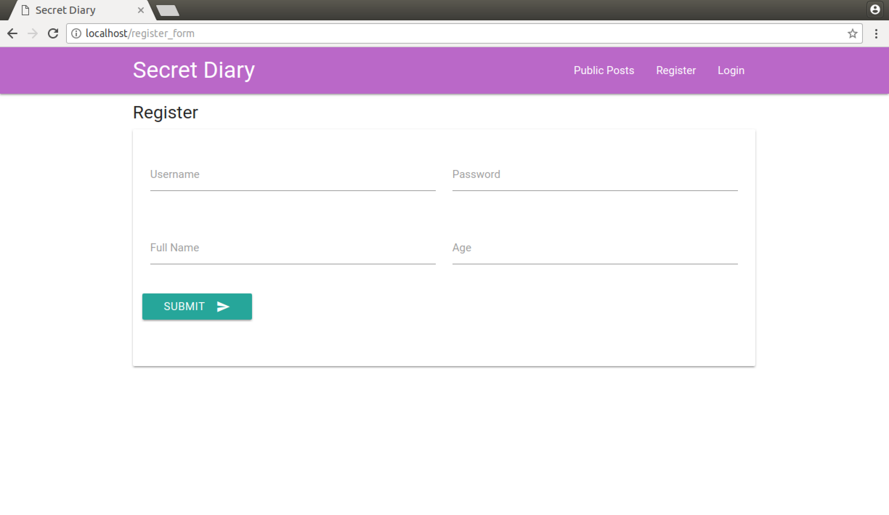
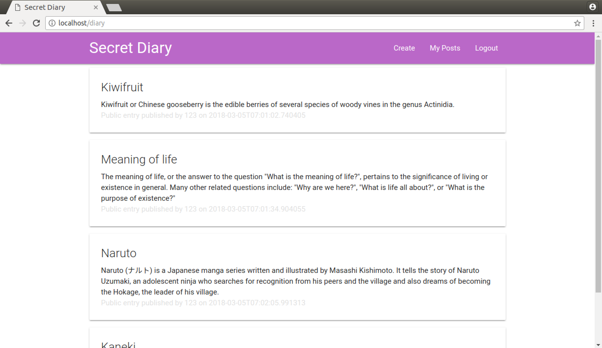
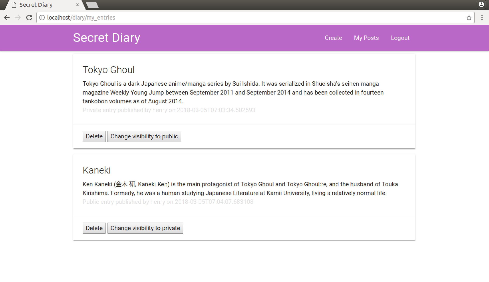
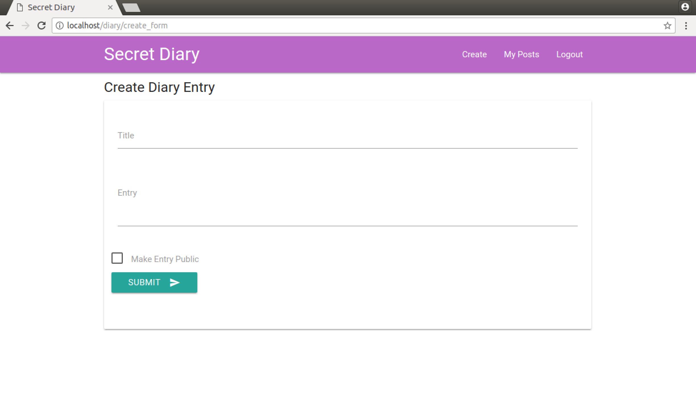

# rest-api-development

CS5331 Assignment 1 Project Reference Repository

## Instructions

Your objective is to implement a web application that provides the endpoints
specified here: https://cs5331-assignments.github.io/rest-api-development/.

The project has been packaged in an easy to set-up docker container with the
skeleton code implemented in Python Flask. You are not restricted in terms of
which language, web stack, or database you desire to use. However, please note
that very limited support can be given to those who decide to veer off the
beaten path.

You may be required to modify the following files/directories:

- Dockerfile - contains the environment setup scripts to ensure a homogenous
  development environment
- src/ - contains the front-end code in `html` and the skeleton Flask API code
  in `service`
- img/ - contains images used for this README

Assuming you're developing on an Ubuntu 16.04 machine, the quick instructions
to get up and running are:

```
# Install Docker

sudo apt-get update
sudo apt-get install \
    apt-transport-https \
    ca-certificates \
    curl \
    software-properties-common
curl -fsSL https://download.docker.com/linux/ubuntu/gpg | sudo apt-key add -
sudo add-apt-repository \
   "deb [arch=amd64] https://download.docker.com/linux/ubuntu \
   $(lsb_release -cs) \
   stable"
sudo apt-get update
sudo apt-get install docker-ce

# Verify Docker Works

sudo docker run hello-world

# Run the skeleton implementation

sudo ./run.sh
```
(Docker CE installation instructions are from this
[link](https://docs.docker.com/install/linux/docker-ce/ubuntu/#install-using-the-repository).)

**Please consult your assignment hand-out for detailed setup information.**

## Grading

The implementation will be graded in an automated fashion on an Ubuntu 16.04
virtual machine by building the docker container found in your repository and
running it. The grading script will interact with your API.

The following ports are expected to be accessible:

1. 80, on which static HTML content, including the front-end, is served.
2. 8080, on which the API is exposed.

To verify this, please run the following commands:

```
sudo ./run.sh
```

On a different window:

```
curl http://localhost:80
curl http://localhost:8080
```

If a response is received, you're good to go.

**Please replace the details below with information relevant to your team.**

## Screenshots
### Login

### Register

### Public entries

### Authenticated user's entries with delete and change permissions

### Create entry


## Administration and Evaluation

### Team Members

1. Chai Ming Xuan
2. Tan Yi Yan
3. Tan Wee Chen William

### Short Answer Questions

#### Question 1: Briefly describe the web technology stack used in your implementation.

Answer:

On the backend, we used the Flask microframework for the web application,  SQLite as the database and Flask-SQLAlchemy as the database ORM.

As for the frontend, we mostly used basic HTML, Python Jinja2 for templating, Materialize CSS for styling, and JavaScript libraries such as jQuery and handlebars.

#### Question 2: Are there any security considerations your team thought about?

Answer: 

**Storing password hashes**

Instead of storing the password of the the user in plaintext, we stored a hash of the password.

**Protection against SQL injection**

Our web application is not vulnerable to SQL injection attacks as we chose to use SQLAlchemy that provides automatic quoting of special characters such as semicolons and apostrophes. 

**Protection against XSS**

In addition, our web application is also not vulnerable to Cross Site Scritping (XSS) as we enabled Jinja2 to auto escape all values loaded in our web applications' pages.  

**Protection against user enumeration**

When a user submits a wrong username or password when logging in, the server gives a general authentication error message instead of specific messages. This prevents attackers from finding out if they have submitted a non-existent username or a wrong password. They cannot find out if a user exist or not through the login page.

**CSRF** 

A side-effect of not using HTTP Cookies for authentication is that the application is not vulnerable to traditional CSRF, since the session token is not automatically sent, unlike a cookie. We do acknowledge that storing the session token in Local Storage does not automatically make it any more secure than cookies, and comes with its own downsides.

#### Question 3: Are there any improvements you would make to the API specification to improve the security of the web application?

Answer: 

There are a few areas that we can improve on, such as 
- Password strength
- Expiring the password token
- Salting the password

**Password strength**

There are curently no restrictions on the password length and complexity. A user can use an extremely weak password such as `password1` and still be allowed to register. 

**Expiring tokens**

Currently, the server does not expire a token unless it is explictly told to do so via the `/users/expire` API. This may not be ideal as any stolen token will be valid until a `/users/expire` request is sent. To mitigate the damages that can be caused by a stolen token, the server can expire a token automatically after a fixed period of time e.g. after 5 days. 

**Salting the password**

Passwords can be salted before they are hashed in order to defend against dictionary attacks.
 
#### Question 4: Are there any additional features you would like to highlight?

Answer: 

**Checking user authentication** 

When an unauthenticated user tries to access pages that require authentication, they get redirected back to the login page. Similarly, when an authenticated user tries to access access the login and registration page, they get redirected to the public diary entries page.

#### Question 5: Is your web application vulnerable? If yes, how and why? If not, what measures did you take to secure it?

Answer: 

Yes. Our web application is vulnerable in the following ways: 
- Brute-force attacks 
- Spamming user registration 
- Unencrypted traffic in HTTP  
- Token stored in plaintext

**Brute-force attacks**

Attackers can send as many requests as they want to the server, and the number of requests per unit time is not limited. If they know the username of a user, they can make as many password attempts as they want to the server. This is because we have not implemented a feature to throttle requests to a server.

**Spamming user registration**

Attackers can use bots to spam user registrations and fill our database with fake users. This is because we did not implement any mechanisms to verify whether the user is a human or not, such as CAPTCHA. 

**Unencrypted traffic in HTTP**

The web application is served on the HTTP protocol that does not provide confidentiality and integrity. Since all HTTP traffic is unencrypted, a network attacker is able to sniff sensitive data such as passwords and session tokens because all data is sent in the clear. In addition, since there are no integrity checks in HTTP, an attacker can easily modifiy the data sent between the server and the client. 

**Token stored in plaintext**

In the event that the database gets compromised, the attacker will have access to all the tokens stored in the database. Having access to the tokens is equivalent to getting the login credentials of a user. Storing the hash of a password becomes pointless. By hashing the tokens, the attacker will not be able to log into any user's account using the hash of their token.

#### Feedback: Is there any other feedback you would like to give?

Answer: 
- It was good to have the freedom of choice for our tech stack. 
- It was challenging to use Docker. 
- API specification was very clear. 

### Declaration

#### Please declare your individual contributions to the assignment:

1. Chai Ming Xuan
    - Implemented the Users and some of the Diary APIs
    - Wrote the front-end code
2. Tan Yi Yan
    - Implemented some of the Diary API 
    - Wrote the front-end code
3. Tan Wee Chen William
    - Setup the database and designed all its schema 
    - Wrote the front-end code
